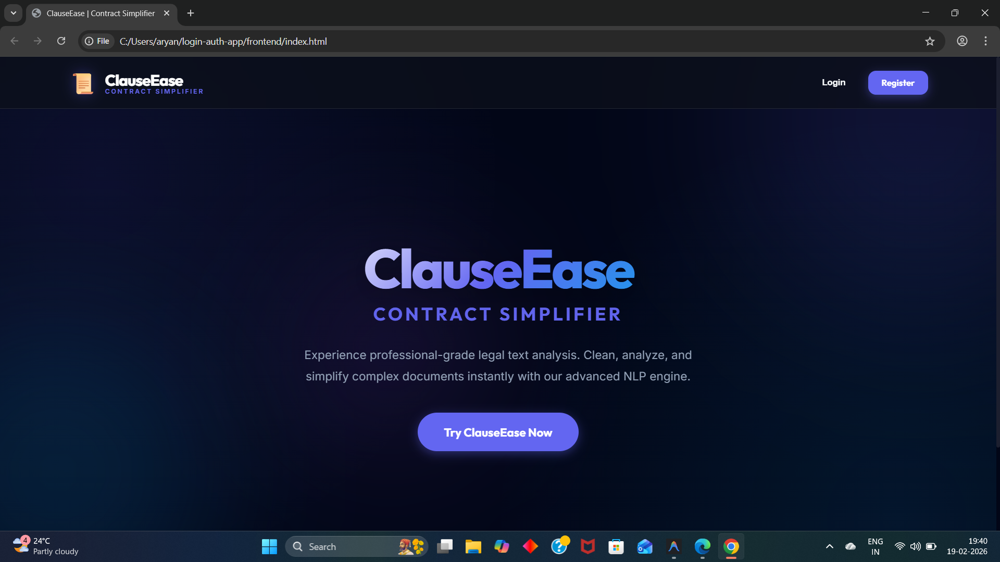
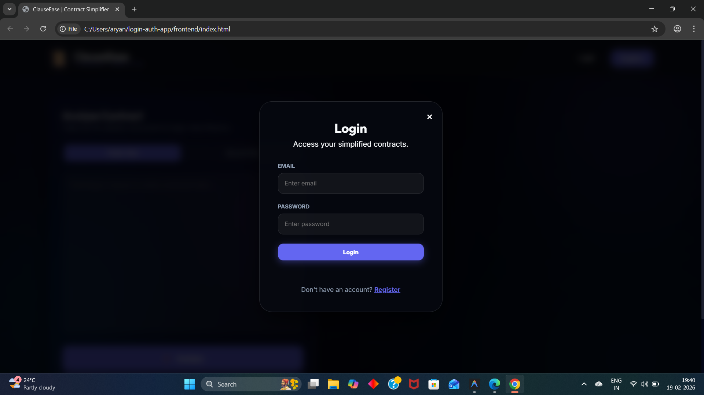
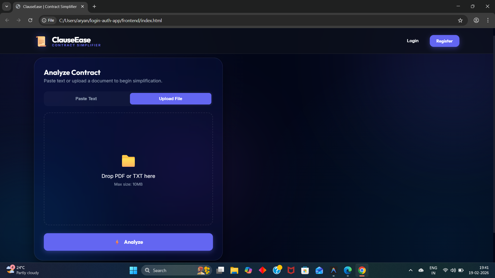
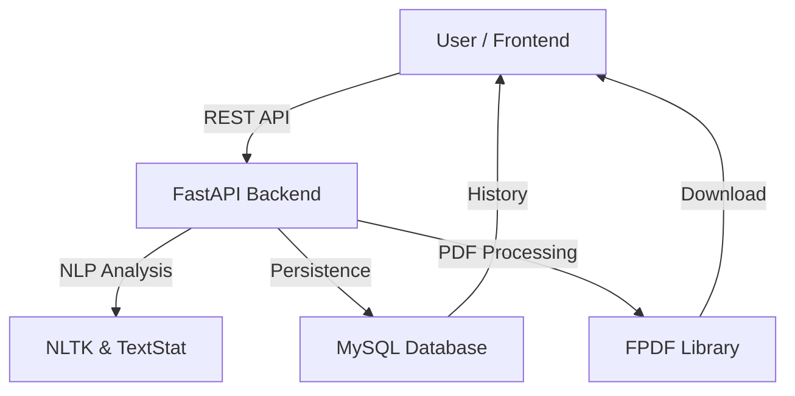

<div align="center">

# 📜 ClauseEase: The Future of Legal Clarity
### Simplify Complex Contracts with AI-Powered Precision

[](https://fastapi.tiangolo.com/)
[](https://www.python.org/)
[](https://www.mysql.com/)
[](https://opensource.org/licenses/MIT)

---

````carousel

<!-- slide -->

<!-- slide -->

````

---

</div>

## ✨ Features that Empower You

ClauseEase isn't just a text cleaner—it's a comprehensive legal intelligence suite.

*   **⚡ Instant Analysis**: Real-time readability scores using Flesch-Kincaid and Gunning Fog indices.
*   **🔴 Visual Risk Assessment**: Our dynamic "Risk Gauge" immediately identifies complex legal pitfalls.
*   **📜 History Dashboard**: Access all your previous analyses in a secure, persistent storage.
*   **📄 Professional Reports**: Export your findings to crisp, clean PDF documents for sharing.
*   **🌙 Premium Dark UI**: A glassmorphism-inspired interface designed for clarity and focus.

---

## 🏗 System Architecture



---

## 🚀 Experience the Power

### 1. Zero-Entry Threshold
Just paste your text or drop a PDF. Our engine handles the heavy lifting of cleaning, segmenting, and tokenizing complex legal jargon.

### 2. Deep Insights
Identify exactly which parts of your contract are "Simple," "Medium," or "High Risk" with our color-coded highlighting engine.

### 3. Persistent Clarity
Never lose an insight. Every analysis is saved to your secure profile, accessible anywhere.

---

## 🛠 Tech Stack

| Component | Technology | Role |
| :--- | :--- | :--- |
| **Frontend** | HTML5, Vanilla CSS | Premium UI & Interaction |
| **API** | Python / FastAPI | High-Performance Logic |
| **Logic** | NLTK, spaCy | Natural Language Processing |
| **Storage** | MySQL | Analysis & User Persistence |
| **Documents** | FPDF | Report Generation |

---

## ⚙️ Installation

```bash
# Clone the repository
git clone https://github.com/aryanmish96-cloud/login-auth-app.git

# Enter project directory
cd login-auth-app

# Install Backend Dependencies
pip install -r backend/requirements.txt
pip install fpdf

# Launch App
cd backend
python app.py
```

---

<div align="center">
  <h3>Powered by AI. Built for Clarity.</h3>
  <p>ClauseEase &copy; 2026</p>
</div>
